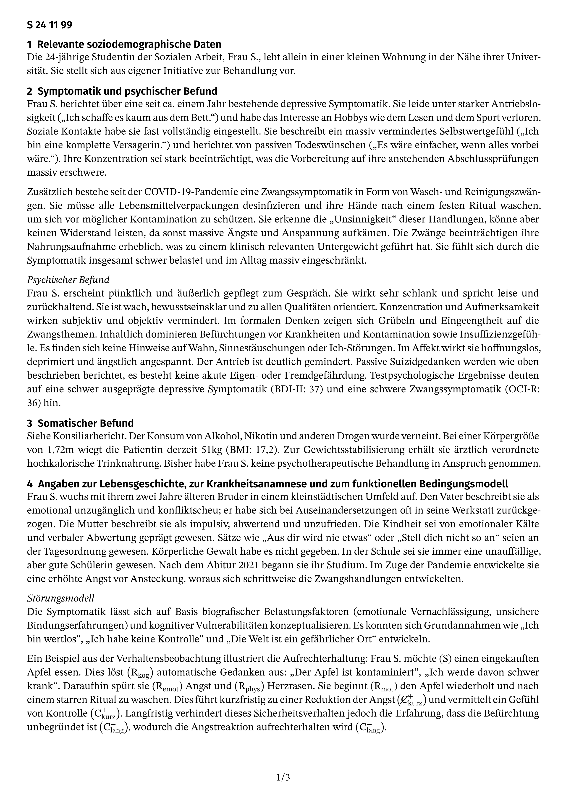
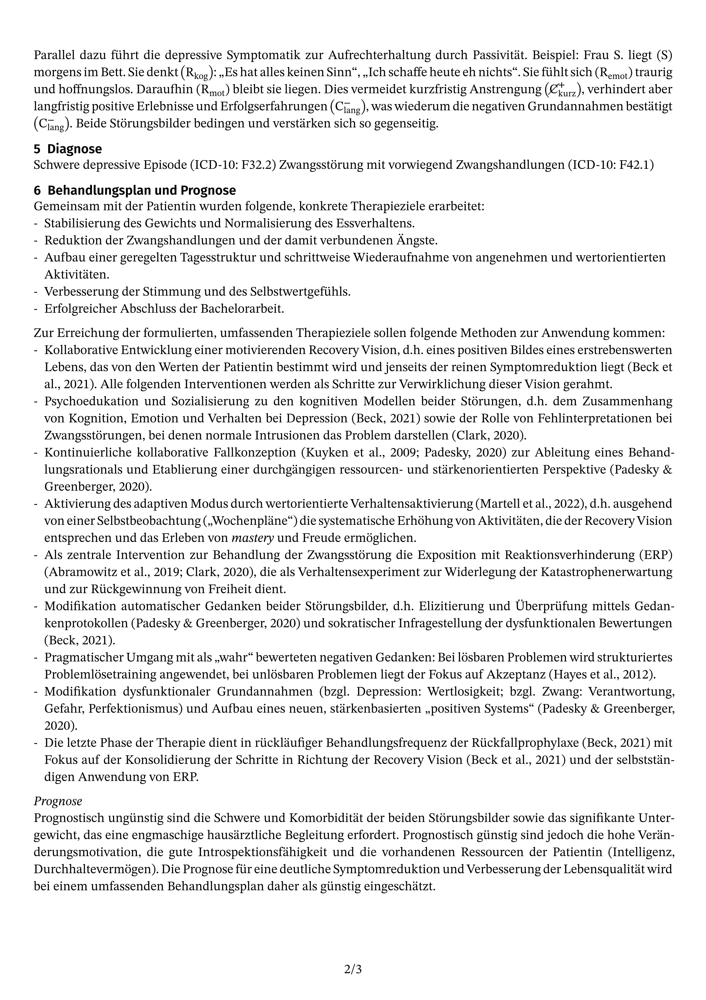

# typst Template for German GKV Psychotherapy Reports

[](LICENSE)
[](https://github.com/benediktclaus/gkv-report/releases)
[](https://github.com/benediktclaus/gkv-report/commits/main)

A `typst` template for creating reports for the official reviewer process of German public health insurance providers (GKV). This template automates the layout and formatting, allowing psychotherapists to focus on the content.

## Preview

The template generates a clean, multi-page report that adheres to the structural requirements of the official forms. Here is a sample:

| Page 1 | Page 2 |
| :---: | :---: |
|  |  |

## Features

* **Pre-defined Layout:** Automatically formats the report structure, including the header with the anonymization code.
* **Official Form Structure:** Follows the sectioning required by official forms (e.g., PTV 2), making it easy to fill in the required information.
* **Easy Configuration:** A simple function call sets up the entire report.
* **Dependency Integration:** Designed to work seamlessly with the [`psymbols`](https://github.com/benediktclaus/psymbols) package for microanalysis notation.

## Installation

This template requires a few dependencies to be installed manually to work as intended.

### Step 1: Install Required Fonts

This template is designed to use specific fonts for optimal appearance. Please download and install them on your system from their official sources:

* **[STIX Two Text & Math](https://www.stixfonts.org/):** The primary font for body text and all mathematical formulas.
* **[Fira Sans](https://fonts.google.com/specimen/Fira+Sans):** Used for headings.

### Step 2: Install `psymbols` Package

This template requires the `psymbols` package for microanalysis symbols. Install it first by following its [local installation guide](https://github.com/benediktclaus/psymbols#installation).

### Step 3: Install This Template

1.  **Download the Latest Release:** Go to the [Releases page](https://github.com/benediktclaus/gkv-report/releases) and download the source code ZIP file of the latest version.
2.  **Find Your Local typst Package Directory:** You need to find the standard package directory for your operating system.
    * **Windows:** `%APPDATA%\typst\packages\` (e.g., `C:\Users\<YourName>\AppData\Roaming\typst\packages`)
    * **macOS:** `~/Library/Application Support/typst/packages/`
    * **Linux:** `~/.local/share/typst/packages/`
3.  **Move the Package Files:** Extract the downloaded ZIP file. Create the following folder structure inside your `packages` directory and move the extracted contents into it.
    `.../packages/local/gkv-report/0.3.0/`
    Inside this `0.3.0` folder, you should place the `typst.toml`, `lib.typ`, and other necessary files.

## Usage

To use the template, import it at the top of your `.typ` file and call the `kvbericht` function within a `#show` rule. You pass all necessary parameters as arguments.

```typst
// Import the report template and the symbol package
#import "@local/gkv-report:0.3.0": *
#import "@local/psymbols:0.1.0" as psy

// Apply the template with all necessary parameters
#show: kvbericht.with(
  chiffre: [S 24 11 99],
  datum: [11.11.2025]
)

// The rest of the document is your report content
= Relevante soziodemographische Daten
Die 24-jährige Studentin der Sozialen Arbeit...

// Use symbols from the psymbols package where needed
... Frau S. möchte #psy.s einen eingekauften Apfel essen. Dies löst ...
```

## Parameters

The `kvbericht.with()` function accepts the following parameters:

| Parameter | Type    | Description                                              |
| :-------- | :------ | :------------------------------------------------------- |
| `chiffre` | Content | The anonymization code (Chiffre) required for the report. |
| `datum`   | Content | The date the report is being written.                    |

## Contributing & Feedback

This package is designed for practical use. If you have suggestions for improvements or encounter any issues, please feel free to [open an issue](https://github.com/benediktclaus/gkv-report/issues).

## License

This project is licensed under the **MIT License**. See the `LICENSE` file for details.